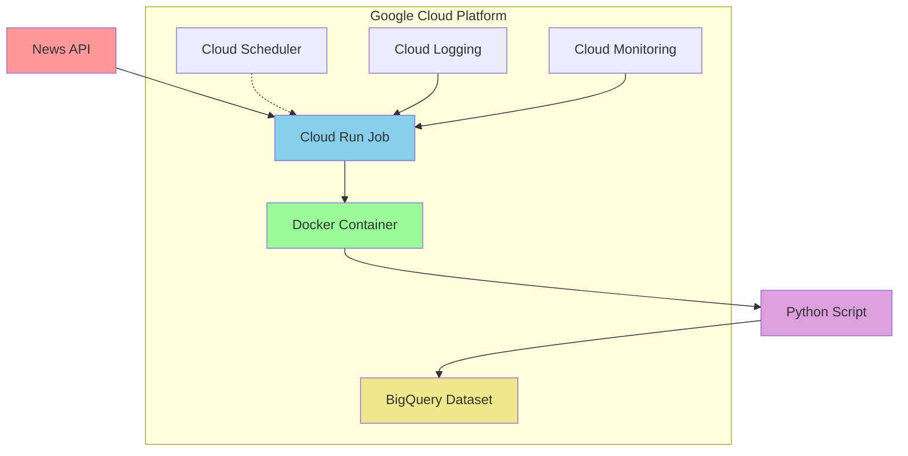

# News API Data Pipeline

A scalable news data collection pipeline that fetches articles from news APIs and stores them in Google BigQuery using Google Cloud Run Jobs.

## Architecture



## Features

- **Automated Data Collection**: Fetches news articles from external news APIs
- **Scalable Processing**: Uses Google Cloud Run Jobs for serverless execution
- **Data Storage**: Stores structured data in Google BigQuery for analysis
- **Containerized**: Dockerized Python application for consistent deployment
- **Monitoring**: Built-in logging and monitoring with Google Cloud services
- **Scheduled Execution**: Can be triggered via Cloud Scheduler for regular updates

## Tech Stack

- **Runtime**: Python 3.9+
- **Container**: Docker
- **Cloud Platform**: Google Cloud Platform
- **Compute**: Cloud Run Jobs
- **Database**: Google BigQuery
- **Scheduling**: Google Cloud Scheduler (optional)
- **Monitoring**: Google Cloud Logging & Monitoring

## Prerequisites

- Google Cloud Platform account
- Google Cloud SDK installed and configured
- Docker installed locally
- Python 3.9+ for local development
- News API key (e.g., NewsAPI.org, Guardian API, etc.)

## Project Structure

```
news-api-pipeline/
├── src/
│   ├── main.py              # Main application script
│   ├── news_fetcher.py      # News API client
│   ├── bigquery_client.py   # BigQuery operations
│   └── config.py            # Configuration management
├── Dockerfile               # Container definition
├── requirements.txt         # Python dependencies
├── cloudbuild.yaml         # Cloud Build configuration
├── job-spec.yaml           # Cloud Run Job specification
├── .env.example            # Environment variables template
├── .gitignore
└── README.md
```

## Setup Instructions

### 1. Clone Repository

```bash
git clone https://github.com/yourusername/news-api-pipeline.git
cd news-api-pipeline
```

### 2. Environment Configuration

```bash
cp .env.example .env
# Edit .env with your configuration
```

Required environment variables:
```env
NEWS_API_KEY=your_news_api_key
GOOGLE_CLOUD_PROJECT=your-gcp-project-id
BIGQUERY_DATASET=news_data
BIGQUERY_TABLE=articles
```

### 3. Local Development

```bash
# Install dependencies
pip install -r requirements.txt

# Run locally
python src/main.py
```

### 4. Build and Deploy

```bash
# Build Docker image
docker build -t gcr.io/PROJECT_ID/news-fetcher .

# Push to Container Registry
docker push gcr.io/PROJECT_ID/news-fetcher

# Deploy Cloud Run Job
gcloud run jobs create news-fetcher-job \
  --image gcr.io/PROJECT_ID/news-fetcher \
  --region us-central1 \
  --set-env-vars NEWS_API_KEY=$NEWS_API_KEY \
  --set-env-vars GOOGLE_CLOUD_PROJECT=$PROJECT_ID
```

## Usage

### Manual Execution

```bash
# Execute the job manually
gcloud run jobs execute news-fetcher-job --region us-central1
```

### Scheduled Execution

Create a Cloud Scheduler job to run automatically:

```bash
gcloud scheduler jobs create http news-fetcher-schedule \
  --schedule="0 */6 * * *" \
  --uri="https://us-central1-run.googleapis.com/apis/run.googleapis.com/v1/namespaces/PROJECT_ID/jobs/news-fetcher-job:run" \
  --http-method=POST \
  --oauth-service-account-email=SERVICE_ACCOUNT_EMAIL
```

## Data Schema

The pipeline stores news articles in BigQuery with the following schema:

| Field | Type | Description |
|-------|------|-------------|
| id | STRING | Unique article identifier |
| title | STRING | Article headline |
| description | STRING | Article summary |
| content | STRING | Full article content |
| author | STRING | Article author |
| source | STRING | News source name |
| url | STRING | Article URL |
| published_at | TIMESTAMP | Publication timestamp |
| created_at | TIMESTAMP | Record creation timestamp |
| category | STRING | Article category |
| language | STRING | Article language |

## Monitoring and Logging

- **Logs**: View execution logs in Google Cloud Logging
- **Metrics**: Monitor job performance in Google Cloud Monitoring
- **Alerts**: Set up alerts for job failures or performance issues

```bash
# View recent logs
gcloud logging read "resource.type=cloud_run_job" --limit=50

# Monitor job executions
gcloud run jobs executions list --job=news-fetcher-job --region=us-central1
```

## Configuration Options

### News API Sources

Currently supported news APIs:
- NewsAPI.org
- The Guardian API
- Associated Press API
- Custom REST APIs

### BigQuery Configuration

```python
# Example table configuration
TABLE_SCHEMA = [
    {"name": "id", "type": "STRING", "mode": "REQUIRED"},
    {"name": "title", "type": "STRING", "mode": "NULLABLE"},
    {"name": "published_at", "type": "TIMESTAMP", "mode": "NULLABLE"},
    # ... additional fields
]
```

## Troubleshooting

### Common Issues

1. **Authentication Errors**
   ```bash
   gcloud auth application-default login
   ```

2. **BigQuery Permission Issues**
   - Ensure service account has BigQuery Data Editor role
   - Verify dataset exists and is accessible

3. **API Rate Limits**
   - Implement exponential backoff
   - Consider multiple API keys for higher limits

4. **Container Build Failures**
   - Check Dockerfile syntax
   - Verify all dependencies in requirements.txt

### Debug Mode

Enable verbose logging:
```bash
export LOG_LEVEL=DEBUG
python src/main.py
```

## Contributing

1. Fork the repository
2. Create a feature branch (`git checkout -b feature/new-source`)
3. Commit your changes (`git commit -am 'Add new news source'`)
4. Push to the branch (`git push origin feature/new-source`)
5. Create a Pull Request

## Cost Optimization

- Use Cloud Run Jobs (pay-per-execution)
- Implement efficient data deduplication
- Set appropriate memory and CPU limits
- Use BigQuery partitioning for large datasets

## Security

- Store API keys in Google Secret Manager
- Use IAM roles with least privilege
- Enable VPC connector for private network access
- Implement input validation and sanitization

## License

This project is licensed under the MIT License - see the [LICENSE](LICENSE) file for details.

## Support

- Create an issue for bug reports
- Check existing issues before submitting
- Provide detailed reproduction steps

---

**Last Updated**: May 2025
