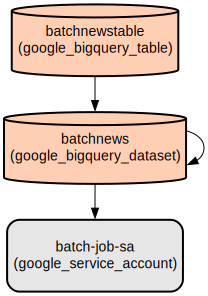

# News Data Pipeline: Automated News Collection and Storage in BigQuery

This project implements an automated data pipeline that collects news articles from the News API and stores them in Google BigQuery. It leverages Google Cloud Platform services including Cloud Run Jobs, Artifact Registry, and BigQuery to create a reliable and scalable batch processing system.

The pipeline fetches top US headlines using the News API, processes the article data (title, description, and URL), and loads it into a BigQuery table for analysis. The entire infrastructure is defined as code using Terraform, making it reproducible and maintainable. The solution runs as a containerized application on Cloud Run Jobs, with the container image stored in Artifact Registry.

## Repository Structure
```
.
├── src/                          # Application source code
│   ├── main.py                   # Core application logic for news data processing
│   ├── Dockerfile                # Container image definition
│   ├── requirements.txt          # Python dependencies
│   └── artifact_push.sh          # Script for pushing container to Artifact Registry
└── terraform/                    # Infrastructure as Code
    ├── main.tf                   # Main Terraform configuration
    └── modules/                  # Reusable Terraform modules
        ├── artifact-registry/    # Artifact Registry configuration
        ├── bigquery/            # BigQuery dataset and table setup
        ├── cloud-run-job/       # Cloud Run Job configuration
        └── iam/                 # IAM roles and service accounts
```

## Usage Instructions
### Prerequisites
- Google Cloud Platform account with billing enabled
- Google Cloud CLI installed and configured
- Terraform >= 1.0.0
- Docker installed and configured
- Python 3.12
- News API key

### Installation

1. Clone the repository:
```bash
git clone <repository-url>
cd news-data-pipeline
```

2. Set up Python virtual environment:
```bash
python -m venv .venv
source .venv/bin/activate  # On Windows: .venv\Scripts\activate
pip install -r src/requirements.txt
```

3. Configure GCP authentication:
```bash
gcloud auth application-default login
gcloud auth configure-docker
```

4. Initialize Terraform:
```bash
cd terraform
terraform init
```

### Quick Start

1. Update the News API key in `src/main.py`:
```python
api_key = 'your-news-api-key'
```

2. Deploy the infrastructure:
```bash
cd terraform
terraform plan
terraform apply
```

3. Build and push the container image:
```bash
cd src
./artifact_push.sh batchnews us-central1 your-project-id
```

### More Detailed Examples

Running the job manually through Cloud Console:
1. Navigate to Cloud Run Jobs
2. Select the "batchnews" job
3. Click "Execute"
4. Monitor execution in the Cloud Console

Querying the collected data:
```sql
SELECT title, description, url
FROM batchnews.batchnewstable
ORDER BY title;
```

### Troubleshooting

Common Issues:
1. Container Push Failures
   - Error: "Permission denied"
   - Solution: Ensure you have run `gcloud auth configure-docker`
   - Check service account permissions

2. BigQuery Insertion Errors
   - Error: "Table not found"
   - Solution: Verify the dataset and table exist
   - Check BigQuery permissions for the service account

Debug Logging:
- Cloud Run Job logs: Available in Cloud Console
- Container logs: Use `docker logs` during local testing
- BigQuery execution logs: Check BigQuery > Job History

## Data Flow
The pipeline collects news data from the News API, transforms it into a structured format, and loads it into BigQuery for analysis.

```ascii
News API ---> Python Script ---> BigQuery
   |             |                |
   [JSON]    [Transform]     [Structured Data]
```

Component Interactions:
1. Python script makes HTTP request to News API
2. News API returns JSON response with articles
3. Script extracts title, description, and URL
4. Data is formatted into BigQuery-compatible rows
5. BigQuery client library handles data insertion
6. Cloud Run Job manages execution lifecycle
7. Artifact Registry stores the container image

## Infrastructure



### IAM
- Service Account: batch-job-sa
  - Roles: Artifact Registry Admin, Storage Admin, BigQuery Admin, Cloud Run Admin

### Storage
- Artifact Registry Repository: batchnews
  - Type: Docker
  - Location: us-central1

### Compute
- Cloud Run Job: batchnews
  - Container Image: batchnews:latest
  - Service Account: batch-job-sa
  - Environment Variables: PROJECT_ID

### Data
- BigQuery Dataset: batchnews
- Table: batchnewstable
  - Schema:
    - title (STRING)
    - description (STRING)
    - url (STRING)